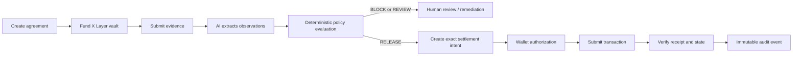
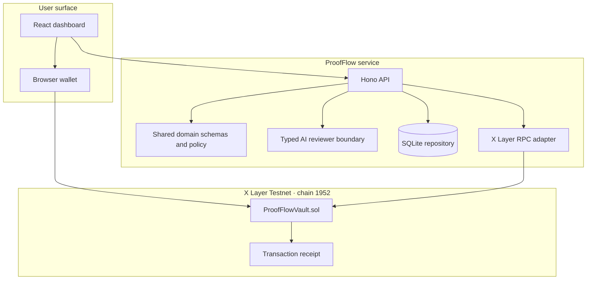
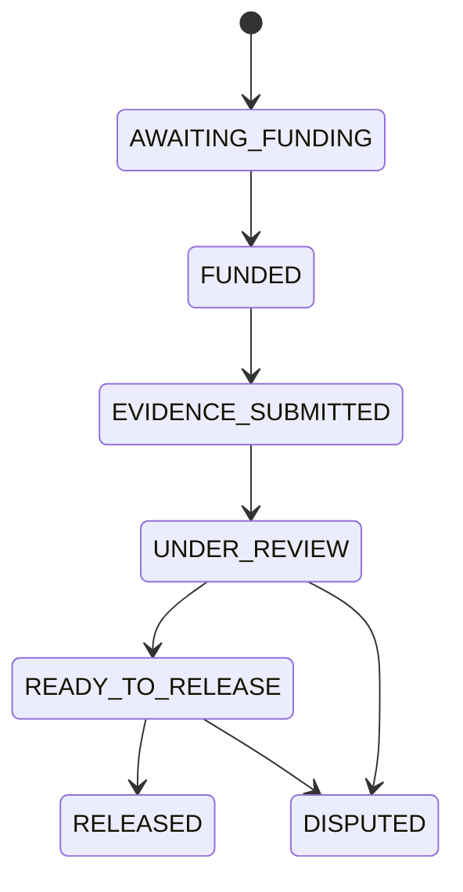
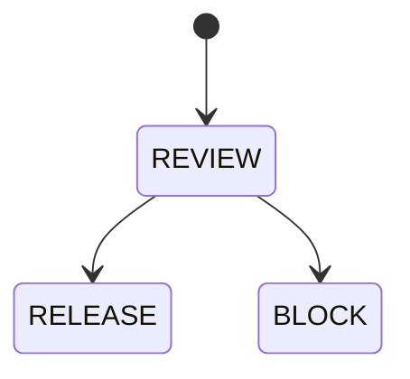
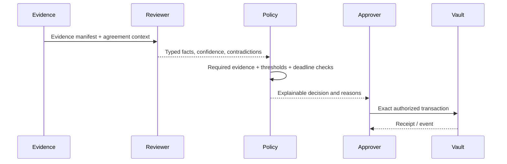

<div align="center">

# ProofFlow

### Verifiable work. Programmable trust.

**An AI-powered trust execution protocol that verifies evidence, enforces deterministic policy, and securely settles milestone-based payments on [X Layer](https://www.xlayer.tech/).**

[](./docs/roadmap.md)
[](https://web3.okx.com/xlayer)
[](https://www.typescriptlang.org/)
[](https://soliditylang.org/)
[](./LICENSE)

[Product specification](./docs/product-spec.md) · [Architecture](./docs/architecture.md) · [Threat model](./docs/threat-model.md) · [Roadmap](./docs/roadmap.md)

</div>

> [!IMPORTANT]
> ProofFlow is a testnet-first prototype. The current implementation targets X Layer Testnet, chain ID `1952`. Do not use production private keys or real funds. The contract requires independent security review before any mainnet deployment.

## Contents

- [Executive overview](#executive-overview)
- [Why ProofFlow exists](#why-proofflow-exists)
- [The product](#the-product)
- [How it works](#how-it-works)
- [Architecture](#architecture)
- [Why X Layer](#why-x-layer)
- [Current implementation](#current-implementation)
- [Quick start](#quick-start)
- [Configuration](#configuration)
- [API surface](#api-surface)
- [Smart contract deployment](#smart-contract-deployment)
- [Security model](#security-model)
- [Performance and reliability](#performance-and-reliability)
- [Repository structure](#repository-structure)
- [Roadmap and status](#roadmap-and-status)
- [Contributing](#contributing)
- [FAQ](#faq)
- [License and acknowledgements](#license-and-acknowledgements)

## Executive overview

ProofFlow is infrastructure for commerce where completion must be proven before money moves.

A business creates a milestone agreement and funds a vault. Evidence is submitted against that agreement. An AI reviewer extracts structured observations from the evidence, but it never has authority to release funds. A deterministic policy engine evaluates the agreement terms and observations. A human or bounded signer approves an exact settlement intent. The ProofFlow vault on X Layer enforces the final state transition and produces a verifiable transaction receipt.

The core separation is deliberate:

```text
AI analyzes evidence
        ↓
Deterministic policy evaluates compliance
        ↓
Human or bounded signer authorizes an exact intent
        ↓
Smart contract settles funds
```

ProofFlow is not an AI-controlled wallet. It is a trust boundary for programmable, explainable settlement.

## Why ProofFlow exists

Autonomous commerce fails at the point where an agent must prove that a promise was fulfilled. Existing workflows tend to split the problem across disconnected tools:

- project software stores status but does not establish financial truth;
- AI can summarize evidence but cannot safely decide what money should do;
- escrow contracts can hold funds but do not understand evidence or business policy;
- human approval often arrives as an opaque click with no durable explanation.

ProofFlow composes those layers without allowing one layer to impersonate another. Evidence is hashed, observations are typed, policy outcomes are explicit, authorization is bounded, and settlement is enforced onchain.

## The product

### The problem

A milestone payment needs more than a checkbox. The payer needs to know:

1. What was promised?
2. What evidence was submitted?
3. What did the reviewer actually observe?
4. Which deterministic rules passed or failed?
5. Who approved the exact amount and recipient?
6. Did the chain accept the settlement?

Without those answers, an autonomous payment workflow is difficult to audit, difficult to dispute, and unsafe to scale.

### The solution

ProofFlow turns a milestone agreement into a verifiable execution path:

| Layer | Responsibility | Authority boundary |
| --- | --- | --- |
| Evidence | Collect references and content commitments | Cannot change policy or funds |
| AI reviewer | Extract typed facts, contradictions, and missing evidence | Advisory only; cannot release funds |
| Policy engine | Apply deterministic thresholds and required-evidence rules | Produces `REVIEW`, `RELEASE`, or `BLOCK` |
| Authorization | Approve a specific settlement intent | Bounded to agreement, recipient, amount, and chain |
| X Layer vault | Hold and release native-token funds | Final enforcement boundary |
| Audit trail | Chain-link lifecycle events and hashes | Makes decisions inspectable |

### Core principles

- **AI never controls money.**
- **Every release is policy-gated and explicitly authorized.**
- **Evidence is committed before it becomes a decision input.**
- **The chain is the settlement source of truth.**
- **Safety takes precedence over liveness.**

## How it works



A realistic execution path:

1. **Business creates an agreement.** The agreement defines the recipient, amount, deadline, required evidence, policy, and X Layer settlement parameters.
2. **Funds are deposited into escrow.** The configured payer funds the ProofFlow vault on X Layer.
3. **Evidence is submitted.** ProofFlow records evidence references and a canonical content hash.
4. **AI reviews the evidence.** The reviewer returns structured observations, confidence, contradictions, and missing-evidence signals.
5. **Policy evaluates compliance.** The policy engine checks required evidence, confidence thresholds, contradictions, deadlines, and milestone status.
6. **A human authorizes settlement.** ProofFlow creates a bounded intent. The wallet signs the exact transaction preview; it does not sign an opaque instruction.
7. **The smart contract releases funds.** The vault enforces payer, recipient, amount, evidence commitment, and one-time release invariants.
8. **ProofFlow verifies the receipt.** The API checks the transaction, receipt status, chain ID, destination, sender, value, calldata, and expected release event before projecting final state.

## Architecture

### System overview



### Ownership boundaries

- **Browser:** presents state, previews transactions, connects a wallet, and requests authorization. It is not trusted to define settlement rules.
- **API:** validates input, orchestrates the lifecycle, persists projections, applies auth/rate/body controls, and reconciles submitted receipts.
- **Domain package:** owns Zod schemas, lifecycle states, canonical evidence hashing, and deterministic policy evaluation. It has no UI, database, AI provider, or RPC dependency.
- **AI reviewer:** emits a typed, bounded result. Provider failures become explicit review failures; they do not silently become approval.
- **X Layer adapter:** validates network identity, encodes contract calls, reads vault state, and verifies transaction receipts against the exact settlement intent.
- **Contract:** is the final custody and state-transition boundary. It does not parse AI output.

### State machines

**Agreement lifecycle:**



**Decision lifecycle:**



## Why X Layer

X Layer is not just a logo on the architecture diagram. ProofFlow needs a low-friction settlement network for workflows where humans, businesses, and autonomous agents may produce many small, auditable payment events.

The current integration uses X Layer Testnet chain ID `1952` and an RPC boundary that validates the connected network before producing transaction previews or reconciling receipts. The vault is deliberately chain-aware: a receipt from another network, another contract, another sender, or another value is not accepted as ProofFlow settlement.

That makes X Layer useful to the product in three ways:

1. **Settlement substrate:** the vault provides a concrete enforcement point for milestone payments.
2. **Verifiability:** transaction hashes, receipt status, block numbers, and event data make the final outcome independently inspectable.
3. **Autonomous-commerce fit:** predictable, low-friction settlement is a better foundation for machine-assisted workflows than an offchain “payment complete” flag.

ProofFlow currently supports one native-token vault path on X Layer Testnet. Stablecoins, multi-chain deployment, and production operations are roadmap items, not current capabilities.

## Current implementation

### Implemented

- React dashboard connected to the API.
- SQLite-backed agreement, manifest, review, settlement-intent, and audit persistence.
- Typed evidence manifests with canonical SHA-256 commitments.
- Deterministic policy evaluation with explicit `RELEASE`, `REVIEW`, and `BLOCK` outcomes.
- Safe, typed AI reviewer boundary with bounded observations and failure handling.
- X Layer Testnet chain validation and native-token vault transaction previews.
- Browser-wallet authorization for exact settlement transactions.
- Receipt reconciliation that verifies the submitted transaction before marking settlement confirmed.
- Link-chained audit events with previous-event and event hashes.
- Request authentication option, CORS allowlisting, body limits, rate limiting, request IDs, security headers, and production SQLite runtime wiring.
- Foundry contract tests and TypeScript unit/API tests.

### Intentionally not claimed

The following are not presented as complete features:

- production wallet custody or key management;
- audited mainnet contracts;
- stablecoin settlement;
- arbitrary file upload and malware scanning;
- a hosted AI provider or model guarantee;
- multi-tenant identity, billing, or enterprise administration;
- dispute arbitration or upgradeable contract governance.

## Quick start

### Prerequisites

- Node.js 20+ and npm 10+;
- Bun 1.2+ for the API development server;
- Foundry for Solidity tests and deployment;
- a browser wallet for live X Layer Testnet authorization;
- optional: testnet OKB for deployment and settlement tests.

Check the tools:

```bash
node --version
npm --version
bun --version
forge --version
```

### Install

```bash
npm install
```

Install Foundry dependencies for the contract project:

```bash
cd contracts
forge install OpenZeppelin/openzeppelin-contracts
forge install foundry-rs/forge-std
cd ..
```

### Run the web application and API

```bash
npm run dev
```

The Vite dashboard runs on `http://localhost:5173`. The API runs on `http://localhost:8787`.

For a clean production-style API process backed by SQLite:

```bash
npm run dev -w @proofflow/api
```

The API development script uses `apps/api/src/server.ts`, which selects `SqliteRepository` and reads `PROOFFLOW_DB_PATH`.

### Run verification

```bash
npm run check
npm audit --audit-level=high --omit=dev
(cd contracts && forge test)
```

`npm run check` runs TypeScript project checks, Vitest, and production builds for the domain, API, and web packages.

## Configuration

Copy `.env.example` into the environment used by the API or shell. Never commit secrets.

| Variable | Purpose | Example |
| --- | --- | --- |
| `VITE_API_BASE_URL` | Dashboard API origin | `http://localhost:8787` |
| `XLAYER_RPC_URL` | X Layer RPC endpoint | `https://testrpc.xlayer.tech/terigon` |
| `XLAYER_CHAIN_ID` | Expected chain ID | `1952` |
| `PROOFFLOW_DB_PATH` | SQLite database path | `./data/proofflow.sqlite` |
| `PROOFFLOW_VAULT_ADDRESS` | Deployed `ProofFlowVault` address | `0x…` |
| `PROOFFLOW_ALLOWED_ORIGIN` | CORS allowlist origin | `http://localhost:5173` |
| `PROOFFLOW_API_TOKEN` | Optional bearer token | secret; do not commit |
| `PROOFFLOW_REQUIRE_AUTH` | Require bearer auth on API routes | `false` locally |
| `PROOFFLOW_ENABLE_DEMO_RESET` | Enable reset endpoint | `false` |
| `PROOFFLOW_RATE_LIMIT` | Mutation requests per window/IP | `60` |
| `PROOFFLOW_RPC_TIMEOUT_MS` | X Layer RPC timeout | `8000` |
| `PROOFFLOW_METRICS_TOKEN` | Optional production bearer token for `/metrics` | secret; do not commit |

For a shared or deployed environment, set `PROOFFLOW_REQUIRE_AUTH=true`, provide a high-entropy `PROOFFLOW_API_TOKEN`, keep `PROOFFLOW_ENABLE_DEMO_RESET=false`, and use an explicit HTTPS `PROOFFLOW_ALLOWED_ORIGIN`.

## API surface

The API is intentionally small and lifecycle-oriented.

| Method | Endpoint | Purpose |
| --- | --- | --- |
| `GET` | `/health` | Liveness and configuration-safe status |
| `GET` | `/metrics` | Operational counters and latency summaries; protect in production |
| `GET` | `/api/v1/agreements` | List agreement projections |
| `POST` | `/api/v1/agreements` | Create an agreement |
| `GET` | `/api/v1/agreements/:id` | Read one agreement |
| `POST` | `/api/v1/agreements/:id/evidence` | Commit a JSON evidence manifest (legacy/test-fixture path) |
| `POST` | `/api/v1/agreements/:id/evidence/upload` | Upload, MIME-check, scan, and content-address one evidence file |
| `GET` | `/api/v1/evidence/blobs/:digest` | Retrieve a clean evidence blob by SHA-256 digest after manifest authorization |
| `POST` | `/api/v1/agreements/:id/review` | Run the typed review boundary |
| `POST` | `/api/v1/agreements/:id/evaluate` | Evaluate deterministic policy |
| `GET` | `/api/v1/agreements/:id/audit` | Read the linked audit trail |
| `GET` | `/api/v1/agreements/:id/chain-preview` | Read vault status and safe transaction previews |
| `POST` | `/api/v1/agreements/:id/settlement-intents` | Create an exact settlement intent |
| `POST` | `/api/v1/settlement-intents/:id/authorization` | Submit a wallet authorization receipt for verification |
| `POST` | `/api/v1/settlement-intents/:id/reconcile` | Reconcile the X Layer receipt |
| `GET` | `/api/v1/xlayer/status` | Read validated X Layer network status |

Mutation endpoints enforce schema validation. Successful settlement is not inferred from a client claim: the reconciliation route checks the receipt and transaction against the stored intent.

### Example: inspect network status

```bash
curl http://localhost:8787/api/v1/xlayer/status
```

### Example: inspect an agreement

```bash
curl http://localhost:8787/api/v1/agreements/agr_demo_001
```

Responses use an envelope such as:

```json
{
  "data": {
    "agreement": {
      "id": "agr_…",
      "state": "UNDER_REVIEW"
    },
    "reviewRun": null,
    "audit": []
  }
}
```

## AI workflow

The AI layer is constrained to observation, not execution.



The reviewer contract is designed so a model provider can later be replaced without changing policy or settlement. Provider output is parsed into bounded schemas. A provider error, malformed response, or missing evidence is a review failure or non-release condition—not an approval.

## Smart contract deployment

The contract project is under `contracts/` and uses Foundry.

Run the local suite:

```bash
cd contracts
forge test
```

The deployment script is intentionally locked to X Layer Testnet:

```bash
export PROOFFLOW_PAYER=0x…
export PROOFFLOW_RECIPIENT=0x…
export PROOFFLOW_AMOUNT=1000000000000000
export PRIVATE_KEY=0x…
forge script script/DeployProofFlowVault.s.sol \
  --rpc-url https://testrpc.xlayer.tech/terigon \
  --broadcast
```

Only use disposable testnet keys. Record the resulting contract address and transaction hash in your local environment; never commit private keys. See [`contracts/DEPLOYMENT.md`](./contracts/DEPLOYMENT.md) for the full procedure.

## Security model

ProofFlow treats every boundary as untrusted until verified.

### AI boundary

AI can suggest observations. It cannot write the policy, approve a settlement, sign a transaction, or call the vault.

### Evidence boundary

Evidence has two explicit paths. The JSON manifest endpoint remains available for deterministic fixtures and external references. The multipart upload endpoint accepts allowlisted media types, enforces a per-file size limit, checks magic bytes for binary formats, writes to quarantine, requires a scanner in controlled production mode, and promotes clean content to SHA-256-addressed storage. Retrieval is only exposed for digests referenced by a stored manifest.

The current file store is local disk, not a multi-region object-storage system. Production uses a persistent local `clamd` daemon at `PROOFFLOW_CLAMD_SOCKET`; scanner unavailability, timeouts, malformed responses, and non-clean verdicts fail closed.

The production API image downloads and verifies current ClamAV definitions during the Docker build, then ships those definitions in the runtime image. Container startup never downloads definitions. The image entrypoint starts the local `clamd`, waits for it to load the baked definitions, and requires a clean daemon-backed readiness scan before starting the API; the API independently repeats fail-closed scanner and storage validation. Baked definitions become stale over time; rebuild and redeploy the Docker image regularly to refresh them, and treat a failed `freshclam` download or build-time readiness scan as a release failure. The definitions stage accepts the `CLAMAV_DEFINITIONS_REFRESH` Docker build argument as its cache key. In Railway, define or update the build-time service variable `CLAMAV_DEFINITIONS_REFRESH` to a new explicit release value such as `2026-08-16.1` whenever a fresh definition download is required; changing that value invalidates only the definitions stage and downstream image layers.

The final image starts as root only for the direct API bootstrap required to prepare a newly mounted Railway `/data` volume. Before production validation, SQLite initialization, or HTTP startup, the bootstrap creates the evidence directories, assigns `/data` recursively to the image's existing `bun` account, and drops the process group and user to `bun`. Failure to prepare the volume or drop privileges aborts startup; the serving API does not run as root.

### API boundary

The API uses strict Zod validation, explicit state-transition checks, bounded request bodies, CORS allowlisting, optional bearer authentication, mutation rate limiting, request IDs, and safe error envelopes. Production configuration must not expose the demo reset route.

### Chain boundary

The adapter verifies chain identity, contract address, transaction sender, destination, calldata, value, receipt status, and expected event data before projecting settlement confirmation.

### Contract boundary

The vault enforces its immutable payer and recipient, one-time funding and release, exact funding amount, evidence commitment, dispute/refund paths, pause control, and reentrancy protection.

### Current security posture

This is a security-conscious testnet prototype, not an audited financial system. Before production use: commission an independent contract audit, add authenticated multi-tenant authorization, threat-model the deployed infrastructure, add file-processing controls, and run adversarial integration tests against the live network.

## Performance and reliability

The MVP favors correctness and auditability over premature throughput optimization.

- Domain policy evaluation is deterministic and in-process.
- SQLite provides durable local persistence for the current single-process deployment shape.
- X Layer RPC calls are isolated behind one adapter and validated at the boundary.
- Mutation requests are bounded by body size and rate limits.
- Structured request logs include request ID, normalized route, status, and duration.
- `GET /metrics` exposes in-process request, RPC, review, and reconciliation summaries; protect it with `PROOFFLOW_METRICS_TOKEN` in production.
- X Layer RPC calls emit method-level success and latency metrics and enforce a bounded timeout.
- Audit events use a linked hash chain for tamper-evident projections.
- Receipt reconciliation is explicit and safe to retry at the API boundary.

Before scaling to production, add connection pooling or a managed database, durable job execution, RPC retries with backoff and circuit breaking, an external metrics backend, queue-backed AI review, and load tests against the target deployment.

## Repository structure

```text
ProofFlow/
├── apps/
│   ├── api/
│   │   └── src/
│   │       ├── index.ts              # Hono routes and lifecycle orchestration
│   │       ├── server.ts             # SQLite-backed runtime entrypoint
│   │       ├── reviewer.ts           # Typed AI reviewer boundary
│   │       ├── xlayer.ts             # RPC, calldata, preview, and receipt verification
│   │       ├── repository.ts         # Persistence contract
│   │       ├── sqlite-repository.ts  # Durable local persistence
│   │       └── memory-repository.ts  # Isolated tests
│   └── web/
│       └── src/
│           ├── main.tsx              # Dashboard and wallet flow
│           └── styles.css            # Product UI styling
├── packages/
│   └── domain/
│       └── src/
│           ├── index.ts              # Schemas, hashes, states, policy
│           └── index.test.ts         # Domain invariants
├── contracts/
│   ├── src/ProofFlowVault.sol       # Native-token vault
│   ├── test/ProofFlowVault.t.sol    # Foundry tests
│   ├── script/                       # Testnet deployment scripts
│   └── DEPLOYMENT.md                 # Deployment procedure
├── docs/
│   ├── architecture.md
│   ├── decisions.md
│   ├── executive-product-review.md
│   ├── product-spec.md
│   ├── threat-model.md
│   ├── ui-ux-spec.md
│   └── roadmap.md
├── .env.example
├── package.json
└── README.md
```

## Roadmap and status

### Current status

**Testnet prototype — Gate C operational hardening complete.**

The current branch contains a working vertical slice across dashboard, API, deterministic domain logic, SQLite persistence, X Layer Testnet integration, wallet authorization, receipt reconciliation, and Foundry contract tests. It is suitable for a controlled hackathon demonstration and technical review.

### Next steps

1. Live testnet end-to-end run with a recorded deployment and reproducible demo path.
2. Multi-tenant identity, authorization, and audit access controls.
3. File upload pipeline with MIME validation, malware scanning, size limits, and content-addressed storage.
4. Production-grade AI provider configuration, prompt-injection defenses, and evaluation datasets.
5. Durable jobs, RPC resilience, load testing, and independent smart-contract audit.
6. Stablecoin settlement, dispute governance, and post-hackathon production architecture.

See [`docs/roadmap.md`](./docs/roadmap.md) for the detailed delivery plan.

## Contributing

ProofFlow is being developed as a safety-critical workflow, not as a collection of unchecked demos.

Before opening a pull request:

```bash
npm install
npm run check
npm audit --audit-level=high --omit=dev
(cd contracts && forge test)
```

Pull requests should:

- keep AI, policy, authorization, and custody boundaries explicit;
- include tests for state transitions and failure paths;
- preserve deterministic hashing and schema validation;
- document security-sensitive changes;
- avoid adding credentials, private keys, generated databases, or build artifacts;
- update the relevant docs when product behavior changes.

## FAQ

### Does AI control funds?

No. AI produces structured observations only. Deterministic policy and explicit wallet authorization sit between review and settlement.

### Is this mainnet-ready?

No. The current deployment target is X Layer Testnet. Treat all keys and funds as disposable until independent review and production hardening are complete.

### What does ProofFlow settle today?

The current MVP settles one native-token milestone-vault path. Stablecoin and multi-asset support are planned.

### Can I use a different AI model?

The reviewer is isolated behind a typed interface. The current implementation is intentionally provider-bounded; replacing or adding a provider is a roadmap task, not a claim of a complete provider marketplace.

### Does ProofFlow store uploaded files?

Yes, when using `POST /api/v1/agreements/:id/evidence/upload`. Files are stored under the configured evidence directory by SHA-256 after MIME checks and scanning. The legacy JSON manifest route stores references only. Production deployment still requires managed object storage, retention policies, backups, and operational scanner monitoring.

### Why not let a smart contract call the AI?

Contracts should enforce deterministic financial rules and remain independent of opaque model behavior. ProofFlow keeps AI offchain and reduces its output to bounded observations before policy and authorization.

## License and acknowledgements

This project is licensed under the [MIT License](./LICENSE).

Built with TypeScript, React, Hono, SQLite, Viem, Solidity, Foundry, OpenZeppelin, and the X Layer ecosystem. The project structure and security boundaries are informed by open-source practices from the Ethereum and OpenZeppelin communities.

---

<div align="center">

**ProofFlow — from evidence to accountable settlement.**

</div>
